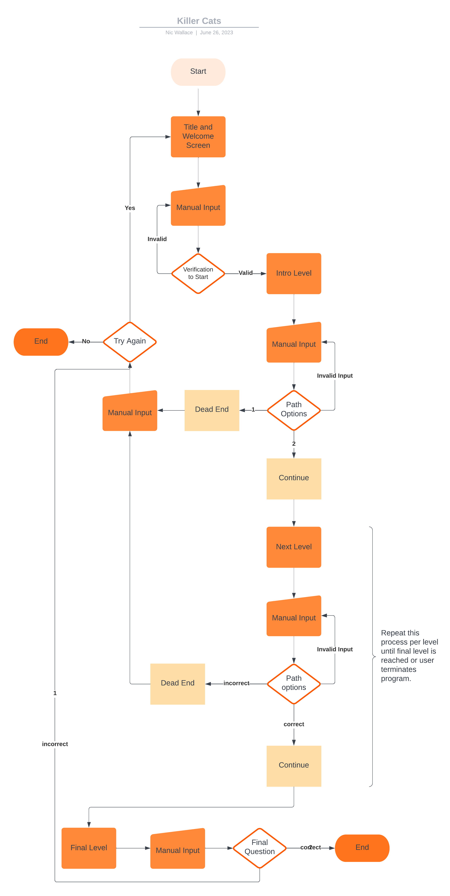

# KILLER CATS

Killer Cats is a text-based adventure game where the objective is to stay alive. After a description of the players surroundings, 
you have to choose wisely or die to an ambush of evil and armed cats. This game is set in a post-apocolyptic world where cats
grew opposable thumbs and rallied against the humans and dogs of the world. The playable character is a human who wakes up with
amnesia and must try to survive.

## UX

I included text art to the welcome page of the game to show users what the game is about as well as giving them some information
about how to play.

## User Stories

### New Site Users

- As a new site user, I would like to have instructions, so that I can play the game with ease.
- As a new site user, I would like to have clear choices, so that I can make informed decisions at each level.
- As a new site user, I would like to be informed of incorrect input, so that I can answer correctly.
- As a new site user, I would like to have the option to retry the game when I fail, so that I can finish the game without having to run the program again.

### Returning Site Users

- As a returning site user, I would like to recognise the game, so that I can remember how the game goes.
- As a returning site user, I would like to see the input options, so that I can make informed in-game decisions.

## Features

### Existing Features

- **Welcome Screen**

    - When the program runs, the welcome screen will be displayed. This will give the user some information on how to play the game, along with title art that fits the game. This lets the user know how to operate the game, and recognise the site if they are returning.

- **Story Area**

    - Once the game is started, and at each level, there will be a few lines of text that will load on the top of the screen. This informs the user of the current level scenario before they are prompted to make a decision to move the game forward. This benefits the user as it allows them to make an informed decision.

- **Path Options**

    - Below the story, the user will have two choices. These are clearly labelled and the user is told what the expected input is in brackets, this reduces confusion for the user. There are two types of options in the game, numbers or text. (The text option looks only for the first letter the user types, to prevent typos from resulting in invalid data and frustrating the user.)

- **Invalid Input**

    - In the event the users input is invalid, they will be brought to a new screen where they are informed of the error, and prompted to input the correct information with a reminder of what the options are. This is useful to the user as it will help them get back on track with the game easily.

- **Try Again**

    - This feature will pop up once the user sees a death story screen. They will have chosen the incorrect path which has led them to their untimely death, and in this scenario the user will be able to try the game again. This is beneficial to the user as it will make it easy for them to restart the game.

### Future Features

- Character Name
    - Enable the user to add a name for their character which will be used throughout the game.
- Level Art
    - Include unique art at the top of the screen for each level.
- Go Back
    - Add a third option in each level that allows the user to return to the previous level.

## Tools & Technologies Used

- [CSS](https://en.wikipedia.org/wiki/CSS) used for the mock terminal, provided by Code Institute.
- [Git](https://git-scm.com) used for version control. (`git add`, `git commit`, `git push`)
- [GitHub](https://github.com) used for secure online code storage.
- [Gitpod](https://gitpod.io) used as a cloud-based IDE for development.
- [Heroku](https://www.heroku.com) used for hosting the deployed back-end site.
- [HTML](https://en.wikipedia.org/wiki/HTML) used for the mock terminal, provided by Code Institute.
- [JavaScript](https://www.javascript.com) used for the mock terminal, provided by Code Institute.
- [Python](https://www.python.org) used as the back-end programming language to create the game in terminal.

## Data Model

### Flowchart

To follow best practice, a flowchart was created for the app's logic,
and mapped out before coding began using a free version of
[Lucidchart](https://www.lucidchart.com/pages/templates?usecase=erd).

Below is the flowchart of the main process of this Python program. It shows the cycle of the program, shortened as the levels are repetitive.

### Functions

The primary functions used on this application are:

- `welcome()`
    - Displays title and welcome test. Verifies users humanity before calling intro.
- `intro()`, `dirt_path()`, `stone_passage()`,`cavern()`, `hillside()`, `camp()`
    - Levels of the game: They print story text, user inputs answer which either progresses to next level or death scene with option to retry game.
- `try_again()`
    - Is called after player death scene, either restarts or terminates program.

### Imports

I've used the following Python package:

- `os`: used for adding a `clear()` function

## Testing

For all testing, please refer to the [TESTING.md](TESTING.md) file.

## Deployment

Code Institute has provided a [template](https://github.com/Code-Institute-Org/python-essentials-template) to display the terminal view of this backend application in a modern web browser.
This is to improve the accessibility of the project to others.

The live deployed application can be found deployed on [Heroku](https://killer-cats-7c9a42c7f6ca.herokuapp.com).

### Heroku Deployment

This project uses [Heroku](https://www.heroku.com), a platform as a service (PaaS) that enables developers to build, run, and operate applications entirely in the cloud.

Deployment steps are as follows, after account setup:

- Select **New** in the top-right corner of your Heroku Dashboard, and select **Create new app** from the dropdown menu.
- Your app name must be unique, and then choose a region closest to you (EU or USA), and finally, select **Create App**.
- From the new app **Settings**, click **Reveal Config Vars**, and set the value of KEY to `PORT`, and the value to `8000` then select *add*.
- If using any confidential credentials, such as CREDS.JSON, then these should be pasted in the Config Variables as well.
- Further down, to support dependencies, select **Add Buildpack**.
- The order of the buildpacks is important, select `Python` first, then `Node.js` second. (if they are not in this order, you can drag them to rearrange them)

Heroku needs two additional files in order to deploy properly.
- requirements.txt
- Procfile

You can install this project's **requirements** (where applicable) using:
- `pip3 install -r requirements.txt`

If you have your own packages that have been installed, then the requirements file needs updated using:
- `pip3 freeze --local > requirements.txt`

The **Procfile** can be created with the following command:
- `echo web: node index.js > Procfile`

For Heroku deployment, follow these steps to connect your own GitHub repository to the newly created app:

Either:
- Select **Automatic Deployment** from the Heroku app.

Or:
- In the Terminal/CLI, connect to Heroku using this command: `heroku login -i`
- Set the remote for Heroku: `heroku git:remote -a app_name` (replace *app_name* with your app name)
- After performing the standard Git `add`, `commit`, and `push` to GitHub, you can now type:
	- `git push heroku main`

The frontend terminal should now be connected and deployed to Heroku!

### Local Deployment

This project can be cloned or forked in order to make a local copy on your own system.

#### Cloning

You can clone the repository by following these steps:

1. Go to the [GitHub repository](https://github.com/Nic-Wallace/killer-cats) 
2. Locate the Code button above the list of files and click it 
3. Select if you prefer to clone using HTTPS, SSH, or GitHub CLI and click the copy button to copy the URL to your clipboard
4. Open Git Bash or Terminal
5. Change the current working directory to the one where you want the cloned directory
6. In your IDE Terminal, type the following command to clone my repository:
	- `git clone https://github.com/Nic-Wallace/killer-cats.git`
7. Press Enter to create your local clone.

Alternatively, if using Gitpod, you can click below to create your own workspace using this repository.

Please note that in order to directly open the project in Gitpod, you need to have the browser extension installed.
A tutorial on how to do that can be found [here](https://www.gitpod.io/docs/configure/user-settings/browser-extension).

#### Forking

By forking the GitHub Repository, you make a copy of the original repository on your GitHub account to view and/or make changes without affecting the original owner's repository.
You can fork this repository by using the following steps:

1. Log in to GitHub and locate the [GitHub Repository](https://github.com/Nic-Wallace/killer-cats)
2. At the top of the Repository (not top of page) just above the "Settings" Button on the menu, locate the "Fork" Button.
3. Once clicked, you should now have a copy of the original repository in your GitHub account.

## Credits

### Content

| Source | Location | Notes |
| --- | --- | --- |
| [Stack Overflow](https://stackoverflow.com/questions/2084508/clear-terminal-in-python) | run.py | how to implement cross platform clear function |
| [Chris Beams](https://chris.beams.io/posts/git-commit) | version control | "How to Write a Git Commit Message" |
| [Real Python](https://realpython.com/python-f-strings/) | title | when to use the different f-strings |
| [YouTube](https://www.youtube.com/watch?v=DEcFCn2ubSg) | run.py | using `.lower().strip()` to check answers |

### Media

| Source | Location | Type | Notes |
| --- | --- | --- | --- |
| [Patorjk](http://patorjk.com/software/taag/#p=display&h=3&v=0&f=Graffiti&t=Killer%20cats) | title | ASCII | use text to ASCII conversion to make title |
| [Joan Stark](https://www.asciiart.eu/holiday-and-events/fireworks) | endgame | ASCII | fireworks art |

### Acknowledgements

- I would like to thank my Code Institute mentor, [Tim Nelson](https://github.com/TravelTimN) for his support throughout the development of this project.
- I would like to thank my partner Aaron, for supporting me during my studies.
- I would like to thank my friends, for staying in online calls to help me stay focused on project work.
