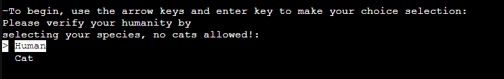

# KILLER CATS

Killer Cats is a text-based adventure game where the objective is to stay alive. After a description of the players surroundings, 
you have to choose wisely or die to an ambush of evil and armed cats. This game is set in a post-apocolyptic world where cats
grew opposable thumbs and rallied against the humans and dogs of the world. The playable character is a human who wakes up with
amnesia and must try to survive.

## UX

I included text art to the welcome page of the game to show users what the game is about as well as giving them some information
about how to play.

## User Stories

### New Site Users

- As a new site user, I would like to have instructions, so that I can play the game with ease.
- As a new site user, I would like to have clear choices, so that I can make informed decisions at each level.
- As a new site user, I would like to be informed of incorrect input, so that I can answer correctly.
- As a new site user, I would like to have the option to retry the game when I fail, so that I can finish the game without having to run the program again.

### Returning Site Users

- As a returning site user, I would like to recognise the game, so that I can remember how the game goes.
- As a returning site user, I would like to see the input options, so that I can make informed in-game decisions.

## Features

### Existing Features

- **Welcome Screen**

    - When the program runs, the welcome screen will be displayed. This will give the user some information on how to play the game, along with some art that fits the game. This lets the user know how to operate the game, and recognise the site if they are returning.

- **Story Area**

    - Once the game is started, and at each level, there will be a few lines of text that will load on the top of the screen. This informs the user of the current level scenario before they are prompted to make a decision to move the game forward. This benefits the user as it allows them to make an informed decision.

- **Path Options**

    - Below the story, the user will have two choices. These are clearly labelled and the user is told what the expected input is in brackets, this reduces confusion for the user. There are two types of options in the game, numbers or text. (The text option looks only for the first letter the user types, to prevent typos from resulting in invalid data and frustrating the user.)

- **Invalid Input**

    - In the event the users input is invalid, they will be brought to a new screen where they are informed of the error, and prompted to input the correct information with a reminder of what the options are. This is useful to the user as it will help them get back on track with the game easily.

- **Try Again**

    - This feature will pop up once the user sees a death story screen. They will have chosen the incorrect path which has led them to their untimely death, and in this scenario the user will be able to try the game again. This is beneficial to the user as it will make it easy for them to restart the game.

### Future Features

- Character Name
    - Enable the user to add a name for their character which will be used throughout the game.
- Level Art
    - Include unique art at the top of the screen for each level.