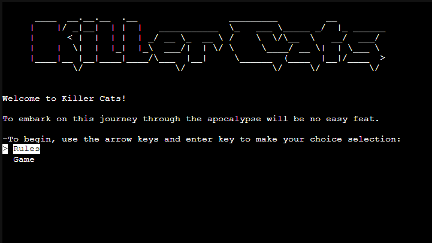
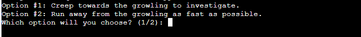

# Testing

Return back to the [README.md](README.md) file.

## Code Validation

### Python

I have used the recommended [PEP8 CI Python Linter](https://pep8ci.herokuapp.com) to validate all of my Python files.

| File | CI URL | Screenshot | Notes |
| --- | --- | --- | --- |
| run.py | [PEP8 CI](https://pep8ci.herokuapp.com/https://raw.githubusercontent.com/Nic-Wallace/killer-cats/main/run.py) |  | W291 trailing whitespace |
| art.py | [PEP8 CI](https://pep8ci.herokuapp.com/https://raw.githubusercontent.com/Nic-Wallace/killer-cats/main/boutique-ado/art.py) |  | W291 trailing whitespace, W605 invalid escape sequence '\_' |

## Defensive Programming

Defensive programming was manually tested with the below user acceptance testing:

| Feature | User Action | Expected Result | Pass/Fail | Comments |
| --- | --- | --- | --- | --- |
| Verification | | | | |
| | Enter 'human' where prompted | User will be brought to intro screen on valid entry | Pass | |
| Path Options | | | | |
| | Enter either option where prompted | Valid input brings user to death/retry screen or next level | Pass | |
| Invalid Input/ Try Again | | | | |
| | Enter one of two supplied options | Valid input brings user to death/retry screen or next level | Pass | |

## User Story Testing

| User Story | Screenshot |
| --- | --- |
| As a new site user, I would like to have instructions, so that I can play the game with ease. |  |
| As a new site user, I would like to have clear choices, so that I can make informed decisions at each level. |  |
| As a new site user, I would like to be informed of incorrect input, so that I can answer correctly. |  |
| As a new site user, I would like to have the option to retry the game when I fail, so that I can finish the game without having to run the program again. |  |
| As a returning site user, I would like to recognise the game, so that I can remember how the game goes. |  |
| As a returning site user, I would like to see the input options, so that I can make informed in-game decisions. |  |